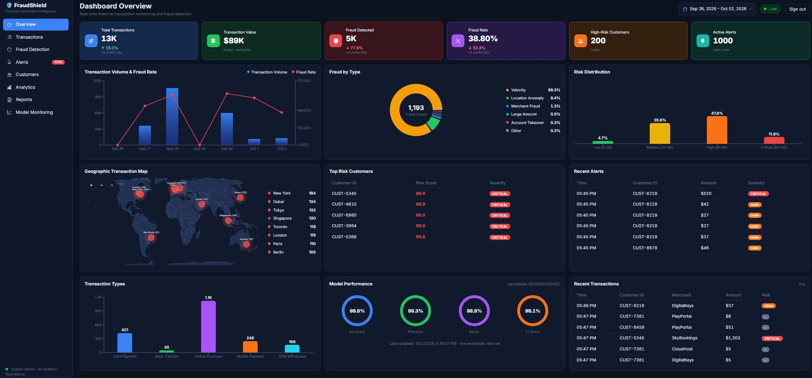
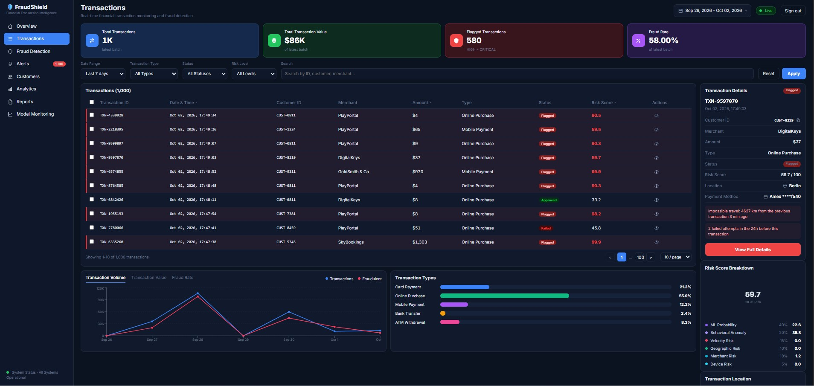
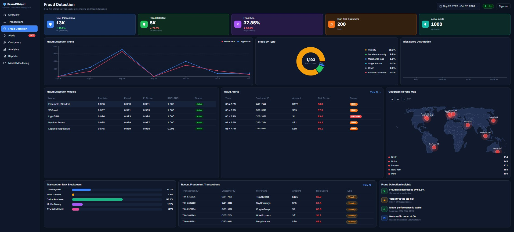
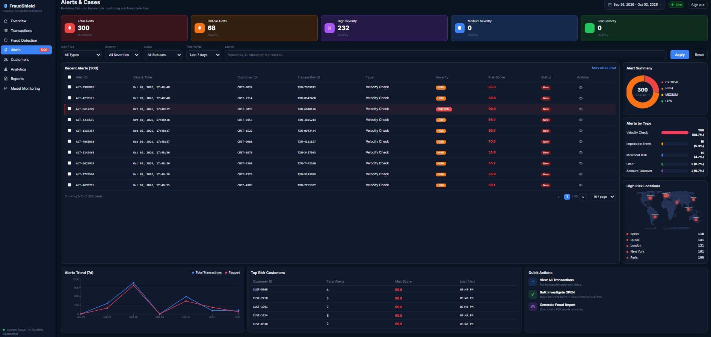
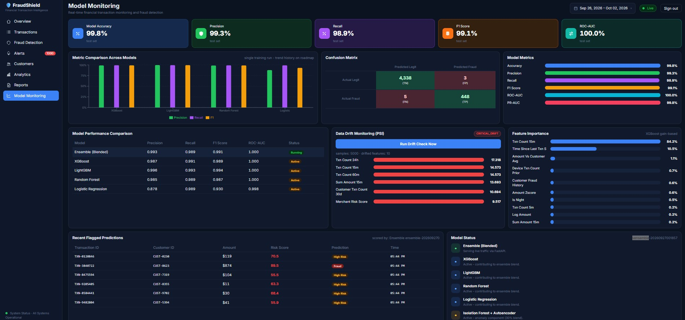

# 🛡️ FraudShield — Real-Time Financial Fraud Detection Platform

[](https://github.com/musanyaks/fraud_detection_system/actions/workflows/ci.yml)
[](https://github.com/musanyaks/fraud_detection_system/blob/main/requirements.txt)
[](https://github.com/musanyaks/fraud_detection_system/tree/main/db)
[](https://github.com/musanyaks/fraud_detection_system/tree/main/streaming)
[](https://github.com/musanyaks/fraud_detection_system/tree/main/api)
[](https://github.com/musanyaks/fraud_detection_system/tree/main/frontend)
[](https://github.com/musanyaks/fraud_detection_system/blob/main/docker-compose.yml)
[](https://github.com/musanyaks/fraud_detection_system/tree/main/models)
[](https://github.com/musanyaks/fraud_detection_system/tree/main/models)
[](https://github.com/musanyaks/fraud_detection_system/tree/main/models)
[](https://github.com/musanyaks/fraud_detection_system/tree/main/models)
[](https://github.com/musanyaks/fraud_detection_system/blob/main/docker-compose.yml)
[](https://github.com/musanyaks/fraud_detection_system/tree/main/dashboard)
[](https://github.com/musanyaks/fraud_detection_system/tree/main/monitoring)
[](https://github.com/musanyaks/fraud_detection_system/tree/main/monitoring)
[](https://github.com/musanyaks/fraud_detection_system/tree/main/.github/workflows)
[](https://github.com/musanyaks/fraud_detection_system/tree/main/tests)

A production-patterned, real-time fraud detection system: **Apache Cassandra** for
high-volume transaction storage, **Apache Kafka** for streaming, a **hybrid ML ensemble**
(supervised + anomaly detection) for scoring, **FastAPI** for serving, and two live
dashboards (React + Streamlit).

Every number on the dashboards traces back to a transaction that flowed through
Kafka seconds earlier. No mock data.

---

## Screenshots

### Dashboard Overview
Live KPIs with vs-yesterday deltas, 7-day trends, risk distribution,
fraud by type and the interactive geographic fraud map.



### Transactions
Real-time stream with staged filters, flagged-row highlighting,
and per-transaction drill-down (score breakdown + detection reasons).



### Fraud Detection
AI-powered risk analysis — severity KPIs, per-model metrics, fraud-type
analytics and case management.



### Alerts
Real-time alert monitoring with severity breakdown, bulk case actions
and customer risk concentration.



### Model Monitoring
Ensemble metrics, confusion matrix, XGBoost feature importances and
live PSI drift detection against training references.



## Architecture

```
                         ┌──────────────────────────────────────────────┐
                         │                DATA PLANE                    │
 Transaction Generator ──►  Kafka (transactions, keyed by customer_id)   │
        (synthetic,       └───────────────┬──────────────────────────────┘
         injectable                       │
         fraud patterns)                  ▼
                            ┌────────────────────────────────────────────┐
                            │  Streaming Consumer                        │
                            │  1. Realtime features (Cassandra + Redis)  │
                            │  2. Ensemble inference                     │
                            │  3. Persist txn (4 access paths) +         │
                            │     prediction + features + profile        │
                            │  4. Alert creation (HIGH/CRITICAL)         │
                            └───────┬───────────────────┬────────────────┘
                                    ▼                   ▼
                     ┌──────────────────────┐   ┌──────────────────────┐
                     │  Apache Cassandra    │   │  Prometheus metrics  │
                     │  query-first schema  │   │  (:9100)             │
                     │  7 tables, RF=1 demo │   └──────────────────────┘
                     └──────────┬───────────┘
                                │
                         ┌──────▼───────────┐
                         │  FastAPI (:8000) │  JWT auth · cached aggregates
                         └──────┬───────────┘
              ┌─────────────────┴─────────────────┐
              ▼                                   ▼
   ┌─────────────────────┐            ┌─────────────────────┐
   │  FraudShield (React │            │  Streamlit (:8501)  │
   │  + Vite, :5173)     │            │  analyst fallback   │
   │  command center     │            └─────────────────────┘
   └─────────────────────┘

   ML lifecycle: MLflow tracking · model registry in Cassandra · PSI drift monitor
```

## Highlights

- **Leak-free feature engineering** — 25 features (transaction velocity 5m/15m/60m/24h,
  amount z-score vs. customer baseline, impossible-travel distance & implied velocity,
  first-seen device/location, trailing merchant fraud rate, account age, time-of-day
  cyclic encoding). Training aggregates use **prior rows only** (`shift`/`cumcount`);
  the online path computes the identical vector from point queries.
- **Hybrid ensemble** — XGBoost + LightGBM + RandomForest + LogisticRegression
  (weights ∝ validation AUC − 0.5) blended 70/30 with an Isolation Forest +
  autoencoder anomaly score, plus deterministic rule boosts (velocity bursts,
  impossible travel). Decision threshold = max-F1 on validation.
- **Human-readable alerts** — every HIGH/CRITICAL score carries weighted reasons
  ("Impossible travel: 8,412 km from previous transaction 9 min ago").
- **Query-first Cassandra schema** — one denormalized table per access path
  (by customer / by time / by merchant / by device), TWCS on the time series,
  alert case management via partition-keyed status transitions.
- **Dual dashboards** — React command center (KPIs with vs-yesterday deltas, live
  table with staged filters + pagination, per-transaction detail modal with score
  breakdown, interactive zoomable geo map, model monitoring) and a Streamlit
  analyst console.
- **ML lifecycle** — MLflow experiment tracking, model registry in Cassandra,
  PSI-based drift monitoring against training reference distributions.

## Tech Stack

| Layer | Technology |
|---|---|
| Language | Python 3.11, JavaScript (React 18) |
| Database | Apache Cassandra 4.1 (query-first schema) |
| Streaming | Apache Kafka 7.5 (+ Zookeeper), consumer-group offset management |
| ML | XGBoost, LightGBM, scikit-learn (RF, LR, IsolationForest, MLP autoencoder) |
| API | FastAPI, JWT (python-jose), Prometheus client |
| Cache | Redis 7 (feature/profile cache with datetime-safe serialization) |
| Dashboards | React 18 + Vite + Recharts + react-simple-maps; Streamlit + Plotly |
| ML lifecycle | MLflow |
| Monitoring | Prometheus, Grafana |
| Deployment | Docker Compose (11 services), restart policies + readiness gates |
| Testing | Pytest (8 tests), Babel parse gate, JSX import guard, ESLint |
| CI | GitHub Actions — pytest, JSX import guard, ESLint |

## Quick Start

Prerequisites: Docker Desktop, Git Bash (Windows) or any POSIX shell, Node 18+.

```bash
git clone https://github.com/musanyaks/fraud_detection_system.git
cd fraud_detection_system

# 1) infrastructure + services (Cassandra, Kafka, Redis, API, dashboards)
docker compose up -d

# 2) wait for Cassandra, then create the schema
until docker compose exec -T cassandra cqlsh -e "SELECT release_version FROM system.local" >/dev/null 2>&1; do sleep 5; done
./scripts/dev.sh schema

# 3) train the ensemble (~2-4 min: synthetic history, 4 supervised models,
#    IsolationForest + autoencoder, evaluation, MLflow, merchant/customer seed)
docker compose exec -T api python -m models.train

# 4) start streaming (producer runs as a managed service; consumer auto-scores)
docker compose up -d producer consumer

# 5) dashboards
cd frontend && npm install && npm run dev   # http://localhost:5173
# Streamlit fallback: docker compose up -d dashboard        # http://localhost:8501
```

Login: `admin` / `admin123` (see `.env`). Within ~30 seconds the dashboards show
live transactions, risk scores, alerts, and geo-distributed fraud.

Cold start after a reboot: `./scripts/start-all.sh` (readiness-gated startup of
the full stack), then `npm run dev`.

## Configuration

| Variable | Default | Purpose |
|---|---|---|
| `CASSANDRA_HOSTS` | `cassandra` | contact points |
| `KAFKA_BOOTSTRAP` | `kafka:29092` | broker (host mapping: `localhost:9093`) |
| `REDIS_URL` | `redis://redis:6379/0` | feature cache |
| `MLFLOW_TRACKING_URI` | `http://mlflow:5000` | experiment tracking |
| `JWT_SECRET` | change in prod | token signing |
| `ADMIN_PASSWORD` / `ANALYST_PASSWORD` | demo values | API users (hash in prod) |

## API

`http://localhost:8000/docs` — interactive OpenAPI. All routes (except `/health`)
require `Authorization: Bearer <JWT>` from `POST /api/v1/auth/token`.

| Endpoint | Purpose |
|---|---|
| `POST /api/v1/transactions/score` | synchronous end-to-end scoring of one transaction |
| `GET /transactions/recent?limit=` | latest transactions (today's partition) |
| `GET /predictions/recent?limit=` | latest ensemble predictions + reasons |
| `GET /predictions/{txn_id}` | full assessment for one transaction |
| `GET /metrics/overview` | exact-count KPIs + yesterday baselines (15 s cache) |
| `GET /metrics/analytics` | daily/hourly series, risk distribution, fraud types, geo points (30 s cache) |
| `GET /alerts?status=` / `PATCH /alerts/{id}` | case list / status transition & assignment |
| `GET /customers/summary` | per-customer risk rows + distribution + top categories |
| `GET /models/evaluation` | test-set metrics incl. per-model and curves |

## Data Model (query-first)

No joins, no `ALLOW FILTERING` on hot paths — one table per question:

| Table | Answers |
|---|---|
| `transactions_by_customer` | customer history → velocity/behavioral features |
| `transactions_by_time` | live feed + daily KPIs (TWCS, day-bucketed) |
| `transactions_by_merchant` | merchant analytics |
| `transactions_by_device` | device novelty & sharing checks |
| `fraud_predictions_by_time/customer/transaction` | scored results per access path |
| `fraud_alerts_by_status` / `by_id` | case management (status = partition key) |
| `customer_risk_profiles` | rolling behavior (avg/std amount, known devices/locations) |
| `model_monitoring` / `model_registry` | metrics history & version lineage |

## ML Pipeline

```
generate (injectable patterns: CARD_TESTING, LARGE_PURCHASE,
          IMPOSSIBLE_TRAVEL, ACCOUNT_TAKEOVER)
   → engineer 25 features (training: prior-rows-only aggregates;
     online: Cassandra point queries + Redis-cached profile)
   → TIME-BASED split 80/10/10 (fraud is non-stationary; no random splits)
   → train 4 supervised models (scale_pos_weight / class_weight balanced)
   → IsolationForest + autoencoder on standardized features (trained on legit only)
   → ensemble weights ∝ (val AUC − 0.5); threshold = max-F1 on validation
   → evaluate on untouched test window → bundle.joblib + evaluation.json
   → reference stats for PSI drift → MLflow → registry in Cassandra
```

Online scoring: `risk = 0.7·supervised + 0.3·anomaly + rule_boosts`,
mapped to LOW/MEDIUM/HIGH/CRITICAL (0-30/30-55/55-80/80-100).

## Testing & CI

```bash
python -m pytest -q          # feature-engineering leakage guards, ensemble rules
./scripts/dev.sh test        # same, inside the container
node ../.github/scripts/jsx_guard.mjs   # chart-import guard (runs pre-dev too)
cd frontend && npx eslint src
```

GitHub Actions runs pytest (with `pythonpath=.`), a JSX parse/import guard, and
ESLint on every push.

## Operations Runbook

| Symptom | First response |
|---|---|
| Dashboard empty, "waiting for stream" | `docker compose ps` → is producer/consumer up? Kafka offsets growing? (`./scripts/up.sh` heals ordering) |
| Consumer log `kafka not ready (n/30)` | it's waiting for the broker by design; if it exhausts, broker isn't up → `docker compose up -d kafka zookeeper` |
| Kafka won't start (`InconsistentClusterId`) | dev-only reset: `docker compose rm -f kafka zookeeper && docker compose up -d zookeeper kafka` |
| Transient 500s on heavy endpoints | by design they serve stale cache; if persistent, check Cassandra load (`docker compose logs cassandra`) |
| Drift check | `docker compose exec api python -m models.monitoring` (PSI vs training reference) |
| Retrain | `./scripts/dev.sh train` (same seed → identical model; re-registers + reseeds) |

Design decisions with teeth: **stale-while-error** on cached aggregates (a Cassandra
ReadTimeout serves last-good data, never a 500), **restart policies + retry loops**
on every stateful dependency, **exact `count(*)` KPIs** (never LIMIT-capped sampling
presented as totals), and **path-scoped client polling** that keeps last-good data
on transient failures.

## Engineering Lessons (found the hard way, fixed permanently)

| Class of bug | Root cause | Permanent fix |
|---|---|---|
| `ModuleNotFoundError: cassandra.cluster` | local package shadowed the driver | renamed to `db/`; verified via in-container grep |
| CQL `Syntax error ... '%'` | `%s` (client-side binding) passed to `prepare()` (server-side) | `prepare(cql.replace("%s", "?"))` — one choke point |
| `offset-naive and offset-aware datetimes` | driver returns naive UTC; Kafka ISO is aware | tz-aware row factory at the persistence layer |
| Every warm-cache message failed | JSON round-trip turned datetimes into strings | normalize on both cache paths; `default=` encoder |
| `KeyError: 'isolation_forest'` | producer/consumer key contract on a serialized artifact | tolerant `.get()` + train→load→predict CI test |
| KPIs frozen at 1,000 | `len(rows)` of a LIMIT-capped query presented as totals | server-side `count(*)` + sampled metrics labeled as such |
| Fraud rate > 100% | numerator (processing-day) ÷ denominator (txn-day) | single-clock denominators; stale-while-error caching |
| Silent dead consumer after restarts | crash before broker ready, no restart policy | retry loops + `restart: unless-stopped` everywhere |
| 613 MB build contexts, apt 404s | no `.dockerignore`; defensive `build-essential` | `.dockerignore`; offline wheel build (`pip download` → `--no-index`) |
| JSX broke repeatedly under edits | regex surgery on large components | atomic file rewrites + Babel parse gate in CI |

## Data Provenance & Honest Deviations

- Transactions are **synthetic** (a generator with four injectable, learnable fraud
  patterns at ~4% base rate) — no real PII. Customer labels (`CUST-7842`, `TXN-…`)
  and payment instruments (`Visa ****4587`) are deterministic hashes of real UUIDs,
  the same display pattern production UIs use for tokenized cards.
- The 6-segment risk breakdown maps the reference design's taxonomy onto the
  ensemble's real components (supervised / anomaly / rule contributions).
- "vs yesterday" deltas are real comparisons, not fixed percentages; low-volume
  days produce noisy rates by construction.

## Roadmap

- Maintained `daily_stats` counters table (kill `count(*)` scans at scale)
- WebSocket fan-out for push updates (polling → streaming)
- SHAP-based per-prediction attributions (upgrade the reason engine)
- Keyset pagination over full history; Kafka exactly-once (idempotent producer)
- Airflow DAG: retrain → evaluate → drift gate → register → deploy
- Multi-node Cassandra (RF=3, `LOCAL_QUORUM`), integer-cent amounts, k8s manifests

## License

MIT
